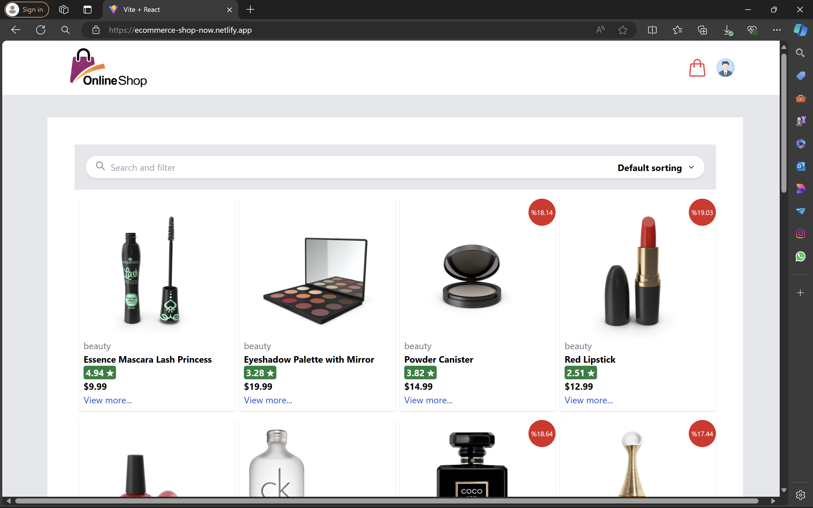
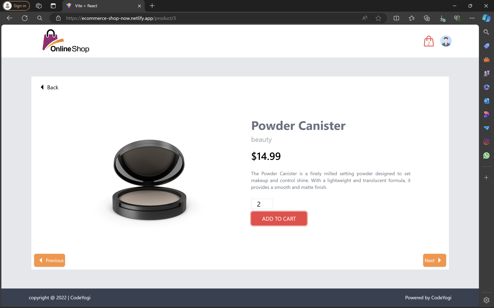
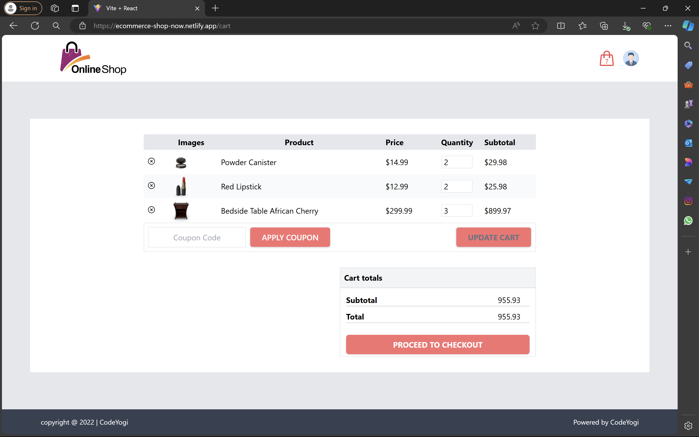
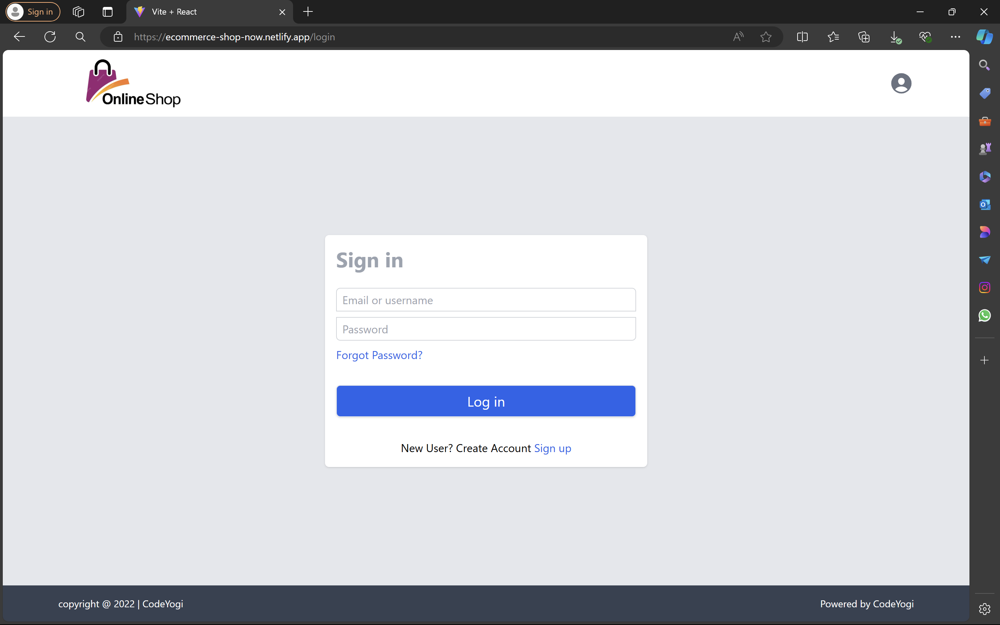

# E-Commerce Website

## Overview

This e-commerce website is built with React and Tailwind CSS. It provides a complete shopping experience where users can browse products, log in, sign up, manage their cart, and perform various actions such as searching, sorting, and logging out.

## Features

- **User Authentication:** Log in and sign up to access and manage your cart.
- **Shopping Cart:** Add products to your cart and view them.
- **Product Search:** Easily search for products.
- **Sorting:** Sort products to find what you need quickly.
- **Logout Functionality:** Log out from your account.

## Technologies Used

- **React:** For building the user interface.
- **Tailwind CSS:** For styling the application.
- **API:** For fetching product data and managing user authentication.

## Screenshots

## Deployment

The application is deployed and available at [https://ecommerce-shop-now.netlify.app/](https://ecommerce-shop-now.netlify.app/).

## Contributing

Contributions are welcome! Please feel free to submit a pull request or open an issue if you have suggestions or find any bugs.

## License

This project does not have a license.

---
